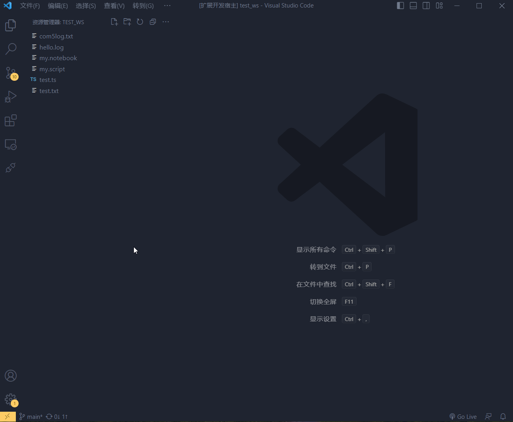
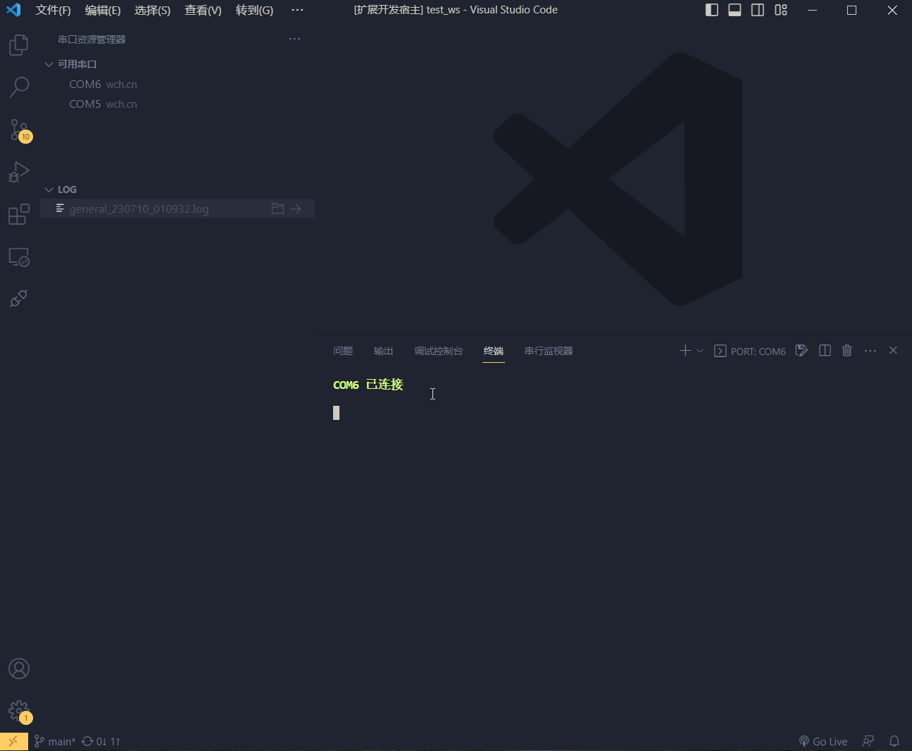

# serial terminal extension for visual studio code 

---

This is a simple terminal interaction serial extension for vscode, it is still a simple prototype, I will make it the best serial extension for vscode in the future.

## Tutorials

### open a serial port

### start to save the log

---

## Currunt features

- Interact with the serial port like a terminal

- Save and view the logs

- Configuring a customised open baud rate

- Very nice script notebook features

## Future features

- Serial port to send and display hex data

- Add configurable items
