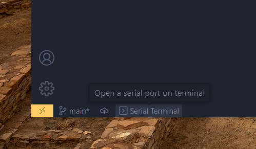

# serial terminal extension for vitual studio code 

---

This is a simple terminal interaction serial extension for vscode, it is still a simple prototype, I will make it the best serial extension for vscode in the future.

## Tutorials

Once you have installed the extension, there will be an entry for serial terminal in the status bar at the bottom left of vscode, click on it and you will know what to do, start enjoying it!

## Release Notes

### 0.0.1

Implementation of the most basic functions for opening the serial port and interacting with it in the terminal

---

## Future features

- Implementing sending and receiving hexadecimal data

- Implementation of logging

- Implementing a running script

- Implementing configuration items