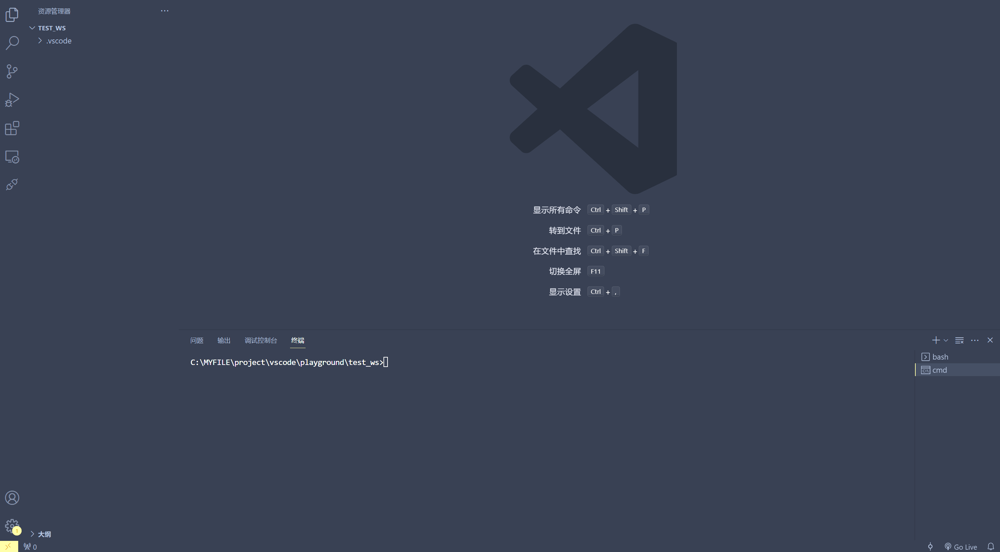

# Notebook with support for vscode terminal

[HomePage](https://github.com/AWSXXF/vscode-serial-terminal/blob/main/scriptNoteBook/README.md)

---

## Tutorials

1. Install this extension

2. Create and open a file with the `.srcnb` extension

3. Add a code block and fill in the code

4. Click the Run button to the left of the code block

