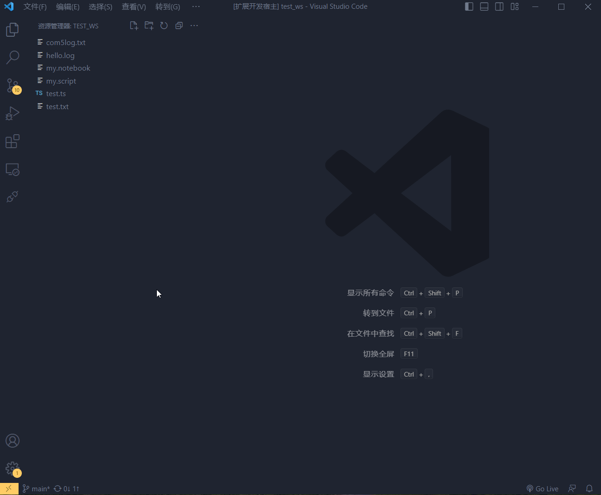
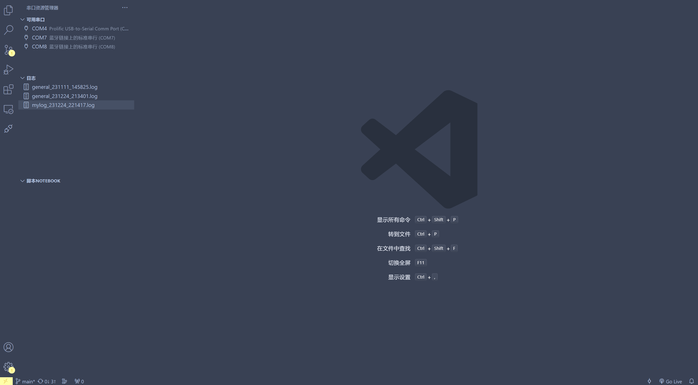
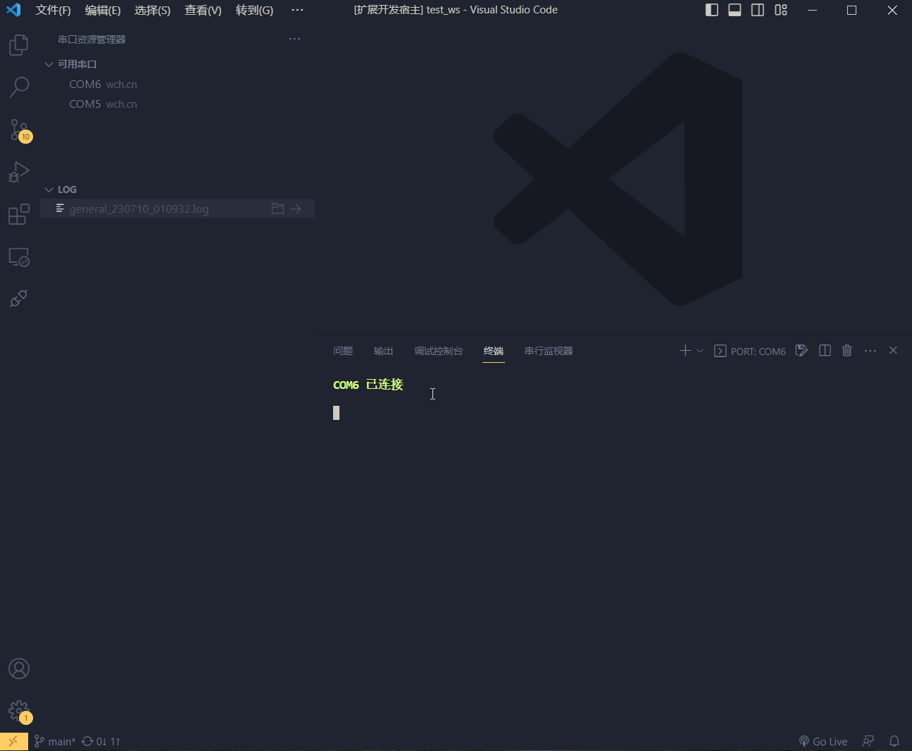
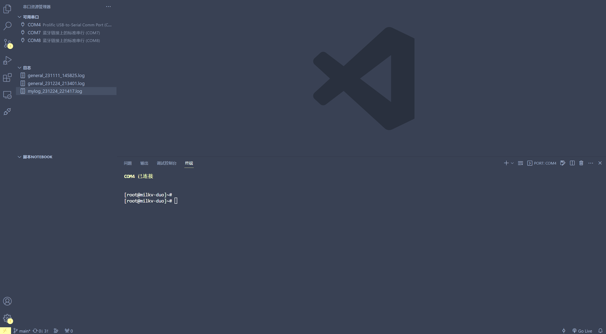

# serial terminal extension for visual studio code

---

This is a simple terminal interaction serial extension for vscode, it is still a simple prototype, I will make it the best serial extension for vscode in the future.

## Tutorials

### open a serial port

### add new configuration

### start to save the log

### using the script notebook

---

## Features

- [x] Interact with the serial port like a terminal

- [x] Save and view the logs

- [x] Configuring a customised open baud rate

- [x] Nice script notebook

- [x] Time stamp

- [x] Add configurable items

- [ ] Serial port to send and display hex data

- [ ] Support for X/Y/Zmodem protocols
